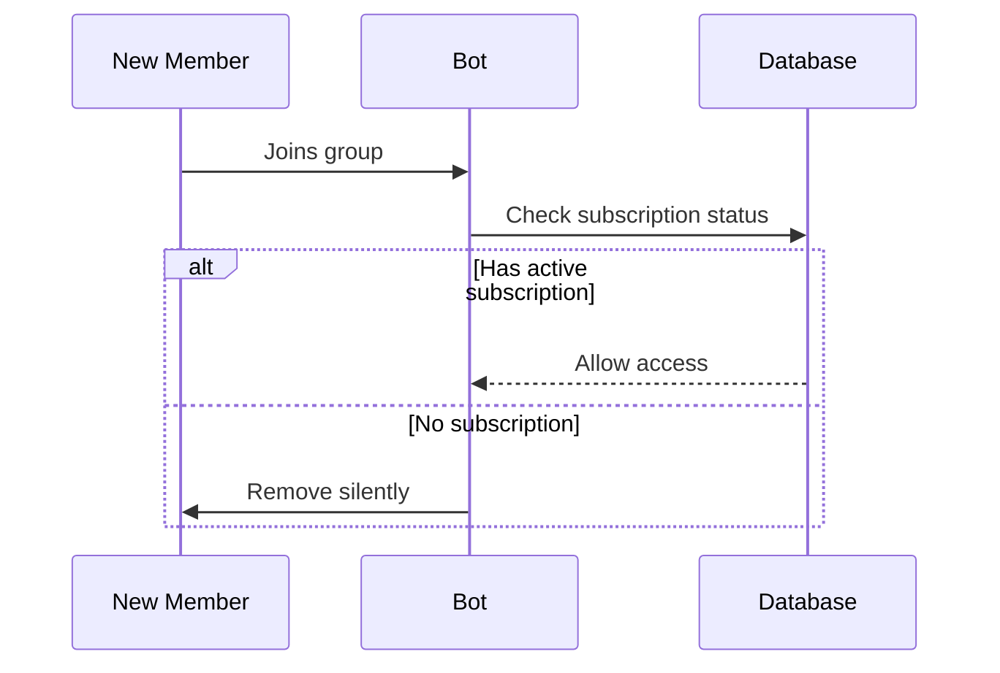

# **Telegram Subscription Enforcement Bot**  
*Automated Member Management for Paid Groups*  

---

## **1. Overview**  
A production-ready Telegram bot that:  
✔ **Enforces paid subscriptions** by removing non-paying members  
✔ **Operates silently** with zero spam  
✔ **Requires minimal setup**  

**Key Features:**  
- Real-time new member screening  
- Hourly subscription validity checks  
- Configurable scan intervals  
- Detailed JSON logging  

---

## **2. Technical Architecture**  

### **Core Components**  
| Component | Purpose |  
|-----------|---------|  
| `bot.js` | Main application logic |  
| MongoDB | Stores groups & subscriptions |  
| Winston | Structured logging |  

### **Data Models**  
**Groups**  
```javascript
{
  telegramGroupId: String, // Unique group ID (e.g., -100123456)  
  isActive: Boolean,      // Toggle bot functionality  
  lastChecked: Date       // Timestamp of last scan  
}
```

**Subscriptions**  
```javascript
{
  telegramUsername: String, // Case-insensitive  
  groupId: ObjectId,        // Reference to Group  
  expiresAt: Date,          // Subscription end  
  status: "active"|"expired"  
}
```

---

## **3. Deployment Guide**  

### **Requirements**  
- Node.js 16+  
- MongoDB 4.4+  
- Telegram bot token  

### **Installation**  
```bash
# 1. Clone repository
git clone https://github.com/your-repo.git
cd subscription-bot

# 2. Install dependencies
npm install

# 3. Configure environment
cp .env.example .env
# Edit .env with your credentials
```

### **Environment Variables**  
| Variable | Description | Example |  
|----------|-------------|---------|  
| `MONGO_URI` | MongoDB connection string | `mongodb://localhost:27017/bot` |  
| `TELEGRAM_BOT_TOKEN` | From @BotFather | `123456:ABC-DEF1234` |  
| `CHECK_INTERVAL_MINUTES` | Scan frequency | `60` |  

### **Running the Bot**  
```bash
node bot.js  # Development
pm2 start bot.js --name "subscription-bot"  # Production
```

---

## **4. Operational Workflow**  

### **Bot Activation**  
1. Add bot to group  
2. Grant **Admin** privileges with:  
   - ✔ *Ban users* permission  
   - ✖ *Anonymous admin* not supported  

### **Member Enforcement Logic**  


---

## **5. Command Reference**  

### **Admin Commands**  
| Command | Description | Permission Level |  
|---------|-------------|------------------|  
| `/force` | Trigger immediate subscription check | Group admin |  
| `/groupinfo` | Show group ID & bot permissions | Group admin |  

### **User Experience**  
- No visible bot messages in chat  
- No DM interactions  

---

## **6. Error Handling**  

| Error | Resolution |  
|-------|------------|  
| `403: Forbidden` | Ensure bot has *Ban Users* permission |  
| `400: Chat not found` | Verify correct group ID format (`-100` prefix) |  
| `DB connection failed` | Check MongoDB credentials/connectivity |  

---

## **7. Maintenance**  

### **Logging**  
- All actions logged to `bot.log` (JSON format)  
- Sample entry:  
  ```json
  {
    "timestamp": "2023-05-20T12:00:00Z",
    "level": "info",
    "message": "Removed @testuser from -100123456"
  }
  ```

### **Backups**  
- Regularly backup MongoDB:  
  ```bash
  mongodump --db=subscription-bot --out=/backups
  ```

---

## **8. Security & Compliance**  

### **Data Privacy**  
- Stores only:  
  - Telegram group IDs  
  - Usernames (hashed optionally)  
  - Subscription dates  

### **Rate Limits**  
- 1-second delay between kick actions  
- Complies with [Telegram API limits](https://core.telegram.org/bots/faq#my-bot-is-hitting-limits-how-do-i-avoid-this)  

---

## **9. Support**  

**For assistance:**  
✉ Email: owarotimiadebowale@gmail.com


--- 


*Confidential – For Internal Use Only*  

---

